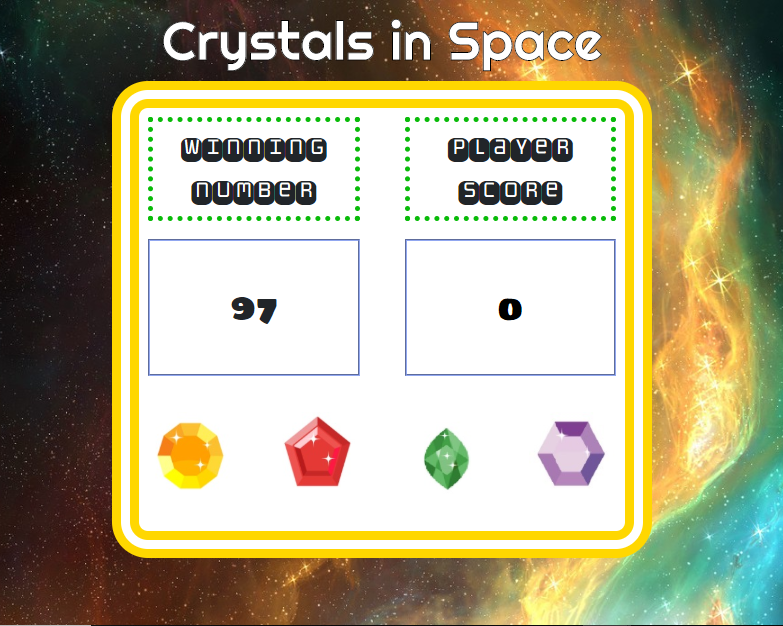

# Number Guessing Game aka Crystals In Space

## How It Works

This is a simple number guessing game powered by JavaScript.

 

The user is given a "winning number" that is preselected by the computer. The user has four options, represented by images of crystals, that have an unknown number value assigned to them.

The object of the game is for the user to match the winning number by clicking the crystals and adding value to their score. The user must determine the value of each crystal by clicking it. 

The user wins when the winning number is matched, and loses when the winning number is exceeded.

---

 

## Link to the Game

[Crystals in Space](https://jparradev.github.io/number-guess/)

